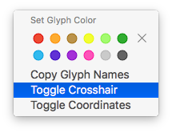
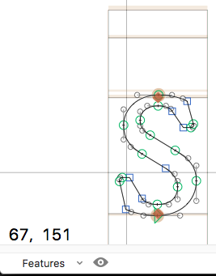

# ShowCrosshair.glyphsReporter

This is a plugin for the [Glyphs font editor](http://glyphsapp.com/) by Georg Seifert. After installation, it will add the menu item *View > Show Crosshair* (de: *Zeige Fadenkreuz*). You can set a keyboard shortcut in System Preferences.

Depending on your crosshair setting, it shows a crosshair either always, or while you drag your mouse pointer. Switch between states via the context menu: right click and select *Toggle Crosshair* (de: *Fadenkreuz umschalten*).

You can also display the crosshair coordinates in the lower left corner of the active tab by choosing *Toggle Coordinates* (de: *Koordinaten ein/ausblenden*):

By default, the coordinate numbers are displayed at a font size of 10 points. Change their size by pasting this line of code into the Macro Window (*Window > Macro Panel*) and pressing the *Run* button:

    Glyphs.defaults["com.mekkablue.ShowCrosshair.fontSize"] = 18.0

Change the value (18.0 in this example) to the desired point size.

### Installation

1. One-click install *Show Crosshair* from *Window > Plugin Manager*
2. Restart Glyphs.

or: 

1. Download the complete ZIP file and unpack it, or clone the repository.
2. Double click the .glyphsReporter file. Confirm the dialog that appears in Glyphs.
3. Restart Glyphs

### Usage Instructions

1. Open a glyph in Edit View.
2. Use *View > Show Crosshair* to toggle the display of the crosshair.
3. Choose *Toggle Crosshair* from the context menu to switch between always on and only on while dragging.
4. Choose *Toggle Coordinates* from the context menu to turn the display of the crosshair coordinates on or off.

### Requirements

The plugin needs Glyphs 2.4 or higher, running on OS X 10.9 or later. It does NOT work with Glyphs 1.x.

### License

Copyright 2015-2017 Rainer Erich Scheichelbauer (@mekkablue).
Based on sample code by Georg Seifert (@schriftgestalt).

Licensed under the Apache License, Version 2.0 (the "License");
you may not use this file except in compliance with the License.
You may obtain a copy of the License at

http://www.apache.org/licenses/LICENSE-2.0

See the License file included in this repository for further details.
