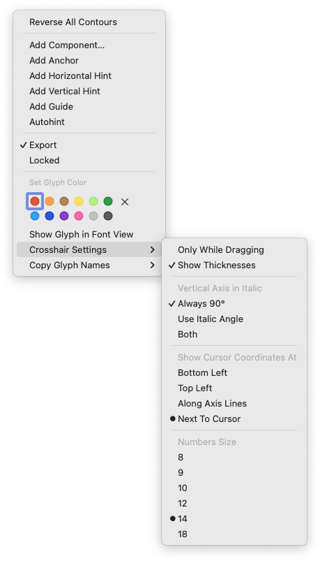

# ShowCrosshair.glyphsReporter

This is a plugin for the [Glyphs font editor](http://glyphsapp.com/) by Georg Seifert. After installation, it will add the menu item *View > Show Crosshair* (de: *Zeige Fadenkreuz*, es: *Mostrar cruz*, fr: *Afficher réticule*, jp: *カーソル照準*). You can set a keyboard shortcut in *System Preferences > Keyboard > Shortcuts > App Shortcuts.*

Depending on your crosshair setting, it shows a crosshair either always, or only while you drag your mouse pointer with the mouse button held down. Switch between states via the context menu: right click and select or deselect *Always Show Crosshair* (de: *Fadenkreuz immer anzeigen*, es: *Siempre mostrar la cruz*, fr: *Toujours afficher le réticule*, jp: *照準を常に表示*).

You can toggle the display of measurements between intersections with the context menu option *Show Thicknesses* (de: *Dicken anzeigen*, es: *Mostrar grosores*, fr: *Afficher les épaisseurs*, jp: *縦横の太さを表示*).

You can also display the crosshair coordinates in the lower left corner of the active tab by choosing *Show Coordinates* (de: *Koordinaten anzeigen*, es: *Mostrar coordinados*, fr: *Afficher les coordonnées*, jp: *マウスの座標を左下に表示*):

By default, the coordinate numbers are displayed at a font size of 10 points. Change their size by pasting this line of code into the Macro Window (*Window > Macro Panel*) and pressing the *Run* button:

    Glyphs.defaults["com.mekkablue.ShowCrosshair.fontSize"] = 18.0

Change the value (18.0 in this example) to the desired point size.

### Installation

1. One-click install *Show Crosshair* from *Window > Plugin Manager*
2. Restart Glyphs.

### Usage Instructions

1. Open a glyph in Edit View.
2. Use *View > Show Crosshair* to toggle the display of the crosshair.
3. Access options (see above) in the context menu.

### Requirements

The plugin needs Glyphs 2.4 or higher, running on OS X 10.9 or later. It does NOT work with Glyphs 1.x.

### License

Copyright 2015–2019 Rainer Erich Scheichelbauer (@mekkablue).
Based on sample code by Georg Seifert (@schriftgestalt) and Jan Gerner (@yanone), contributions by Toshi Omagari (@Tosche), based on code by Rafał Buchner (@RafalBuchner).

Licensed under the Apache License, Version 2.0 (the "License");
you may not use this file except in compliance with the License.
You may obtain a copy of the License at

http://www.apache.org/licenses/LICENSE-2.0

See the License file included in this repository for further details.
